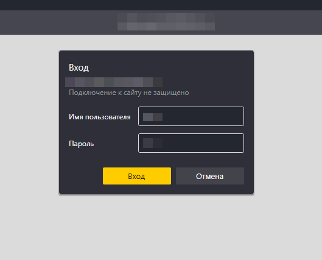

Собирает все внутренние ссылки для указанного сайта. Проверяет доступность этих ссылок и наличие строк с содержанием ".php".

Инструкция:
1. Скачать и запустить скрипт - https://disk.yandex.ru/d/ZK8GvZWviyq4Gw;
2. Ввести адрес сайта {протокол}://{адрес сайта} + enter;
3. Выбрать необходимость аутентификации(стрелки + enter), т.е. - 

   

4. Если "Да", то ввести логин и пароль + enter;
5. После завершения скрипта, данные выгрузятсья в текущую папку в result.csv.
